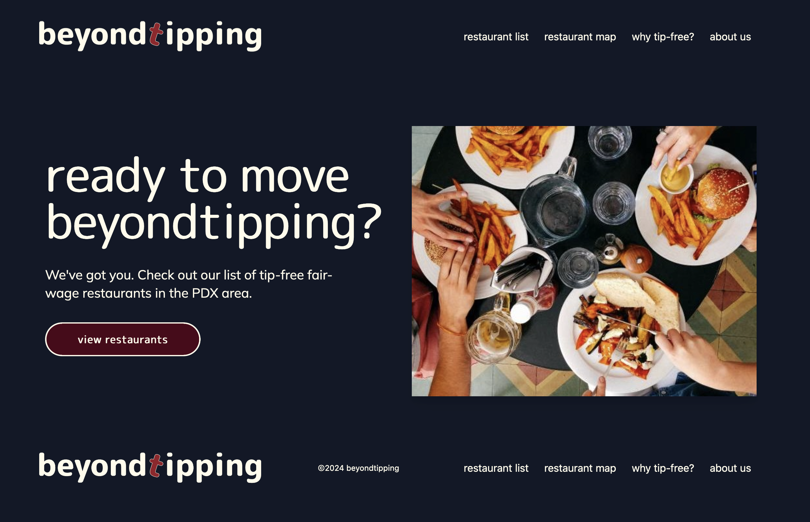
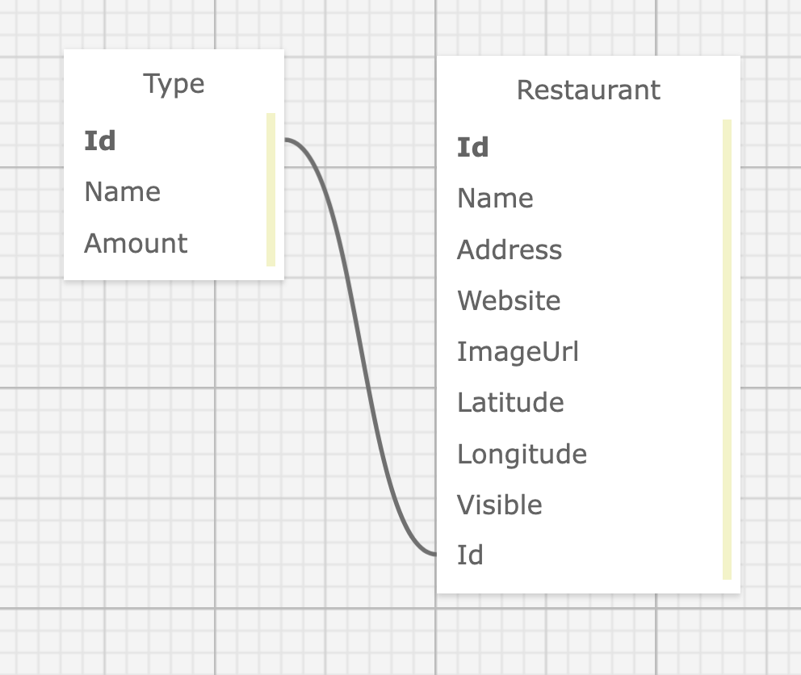

# Beyond Tipping
_by [Brianca Knight](https://github.com/BriancaKnight), [Henry Oberholtzer](https://github.com/henry-oberholtzer), [Kim Robinson](https://github.com/kimmykokonut), [Noah Kise](https://github.com/NoahKise)_



---
### <u>Jump to section</u>
* <a href="#about-the-project">About the Project</a>
  * <a href="#description">Description</a>
  * <a href="#built-with">Built With</a>
  * <a href="#known-bugs">Known Bugs</a>
* <a href="#getting-started">Getting Started</a>
  * <a href="#prerequisites">Prerequisites</a>
  * <a href="#setup">Setup</a>
  * <a href="#api-documentation">API Documentation</a>
* <a href="#stretch-goals">Stretch Goals</a>
* <a href="#license">License</a>
---

## About the Project

## Description
An application that lists restaurants that have removed the tipping model, opting for a flat price on menus or implementing a service fee.  Restaurants available as a list or interactive map.

## Built With


## Known Bugs
* Responsive design: component bleeds on small screen size

## Getting Started

## Prerequisites

#### Install Postman
(Optional) Download and install [Postman] to test API calls(https://www.postman.com/downloads/).

#### Code Editor
  To view or edit the code, you will need a code editor or text editor. The open-source code editor we used is VisualStudio Code.

  1) Code Editor Download: [VisualStudio Code](https://www.npmjs.com/)
  2) Click the download most applicable to your OS and system.
  3) Wait for download to complete, then install -- Windows will run the setup exe and macOS will drag and drop into applications.

## Setup

### Clone repository

1. Navigate to the [repository](https://github.com/henry-oberholtzer/beyondtipping).

2. Click the `Fork` button and you will be taken to a new page where you can give your repository a new name and description. Choose "create fork".

3. Click the `Code` button and copy the url for HTTPS.

4. On your local computer, create a working directory of your choice.

5. In this new directory, via the terminal, type `$ git clone https://github.com/henry-oberholtzer/beyondtipping`.

6. Run the command `cd beyondtipping` to enter into the project directory.

7. View or Edit: On your terminal, type `$ code .` to open the project in VS Code.

8. In VSCode- in project directory of the terminal: type `$ npm install` to compile the application's code and install all needed dependencies.

9. Run local server: `$ npm run dev`
(This will be located at: http://localhost:5173/)
(_this command should run front and back end (http://127.0.0.1:8000/) at the same time_)

### Flask

1. Install Homebrew
`/bin/bash -c "$(curl -fsSL https://raw.githubusercontent.com/Homebrew/install/HEAD/install.sh)"`
2. Install python 3
`$ brew install python@3`
3. Create a virtual environment
`$ python3 -m venv .venv`
4. Enter virtual environment
`$ source .venv/bin/activate`
5. Install packages and dependencies
`$ pip install -r requirements.txt`
6. Run api server: http://127.0.0.1:8000/
`$ python index.py`

- NOTE: If your api server is not running on `http://127.0.0.1:8000/`, run the command `$ python -m flask --app api/index run -p 8000` in your terminal.

### Geoapify API

* In order to fill out the form to add a restaurant to the database you will need an API key from [geoapify](https://www.geoapify.com/). Once you have obtained one, create a file in the root directory of the project called `.env`.
* In your `.env` file, add the following code: `VITE_API_KEY=[YOUR API KEY]`, replacing [YOUR API KEY] with your api key.
* This API is necessary to obtain latitude and longitude coordinates from the address provided to the form, and these values get passed into the database.

### Database

- SQLite is used as the database engine to store the Restaurant and Type data. SQLite is a widely used relational database management system (RDBMS) that doesn’t need a SQL server to work.  It is bundled into Flask and the file is located at beyondtipping/api/instance/test.db (though you don't need to access the file)
- Already setup, but if curious: To initialize or seed the database, this can be done through the Python shell.  [More info here](https://flask-sqlalchemy.palletsprojects.com/en/3.0.x/quickstart/)

<p align="center">

</p>

#### Launch the API
1) Navigate to api directory using the MacOS Terminal or Windows Powershell.
2)  Make sure the webapi server is running at http://127.0.0.1:8000, otherwise in the terminal run the command `python index.py` to run the server to access to the API via Postman (or in-browser via flask rest admin, where you will need to register for access `http://127.0.0.1:8000/admin`)
<!-- * HENRY CONFIRM INFO***re: ADMIN & USER AUTH -->
3) You can close the server at anytime by entering `ctrl` + `c` in the terminal. 

---

## API Documentation
- Explore the API endpoints in Postman

* Account registration
  - None at this time

* API Endpoints

- Base Url: `http://127.0.0.1:8000`

#### HTTP Request Structure
```
GET /restaurants  | Gets list of restaurants from database  
POST /restaurants | Creates new restaurant object
GET /restaurants/{id} | Gets restaurant by id
PATCH /restaurants/{id} | Edits restaurant by id
DELETE /restaurants/{id}  | Deletes restaurant by id
GET /types  | Gets list of tipping types
POST /types | Creates new type object
GET /types/{id} | Gets type by id
PATCH /types/{id} | Edits type by id
DELETE /types/{id}  | Deletes type by id
```
---

#### Example Query
```
http://127.0.0.1:8000/restaurants/1
```

#### Sample JSON Response
```
  {
    "id": 1,
    "name": "Bernstein's Bagels",
    "address": "816 N Russell St, Portland, OR 97227",
    "website": "https://bernsteinsbagels.com/",
    "imageUrl": "https://static1.squarespace.com/static/58715578e6f2e1d4215c94fb/t/62278b3792539d0c2c8cacab/1646758711651/LOGO.jpg?format=1500w",
    "latitude": 45.54178453985534,
    "longitude": -122.67473068332497,
    "visible": True,
    "type_id": 1
  }
```

#### Path Parameters
| Parameter | Type | Default | Required | Description |
| :---: | :---: | :---: | :---: | --- |
| query | string | none | true | Return matches of name or address field.

#### Example Query with path parameter
```
http://127.0.0.1:8000/restaurants?query=bagel
```

#### Sample JSON Response
```
  {
    "id": 1,
    "name": "Bernstein's Bagels",
    "address": "816 N Russell St, Portland, OR 97227",
    "website": "https://bernsteinsbagels.com/",
    "imageUrl": "https://static1.squarespace.com/static/58715578e6f2e1d4215c94fb/t/62278b3792539d0c2c8cacab/1646758711651/LOGO.jpg?format=1500w",
    "latitude": 45.54178453985534,
    "longitude": -122.67473068332497,
    "visible": True,
    "type_id": 1
  }
```
#### Example Query to create restaurant entry
```
POST http://127.0.0.1:8000/restaurants
Content-Type: application/json

 {
    "name": "Gracie's Apizza",
    "address": "7304 N Leavitt Ave, Portland, OR 97203",
    "website": "https://www.graciesapizza.com/",
    "imageUrl": "https://images.squarespace-cdn.com/content/v1/5a790307b7411c447f906450/0c65fe57-4201-4a29-9f93-a89252bf9760/Gracie%27s+Apizza+Round+12+inch+%28no+white%29.png",
    "latitude": 45.589974368346105,
    "longitude": -122.75392355397106,
    "type_id": 1
  }
```

#### Sample JSON Response
200 OK
```
{
    "id": 2, 
    "name": "Gracie's Apizza",
    "address": "7304 N Leavitt Ave, Portland, OR 97203",
    "website": "https://www.graciesapizza.com/",
    "imageUrl": "https://images.squarespace-cdn.com/content/v1/5a790307b7411c447f906450/0c65fe57-4201-4a29-9f93-a89252bf9760/Gracie%27s+Apizza+Round+12+inch+%28no+white%29.png",
    "latitude": 45.589974368346105,
    "longitude": -122.75392355397106,
    "visible": False,
    "type_id": 1
  }
```

---

## Stretch Goals
* Build out Restaurant model (hours, cuisine)
* User register/login/logout to control access for create, edit, delete restaurant data. (Currently admin access only)

## License
MIT License, see license.md for details